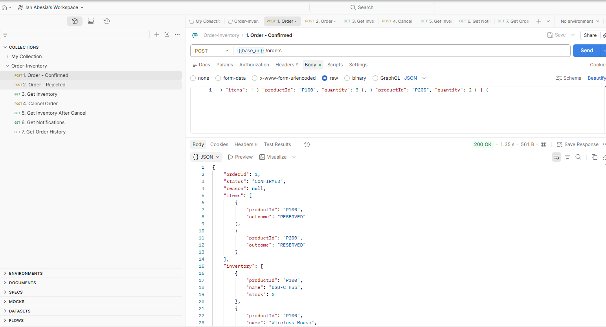
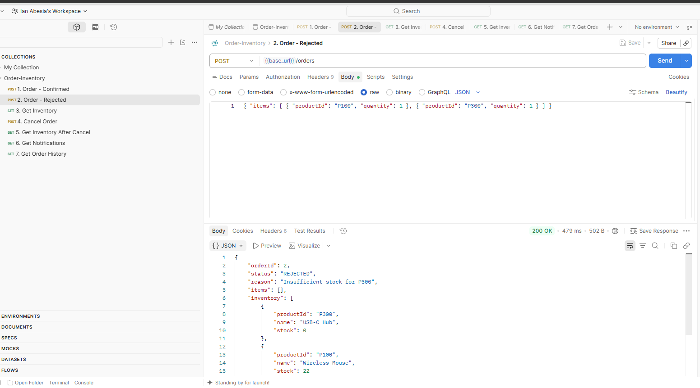
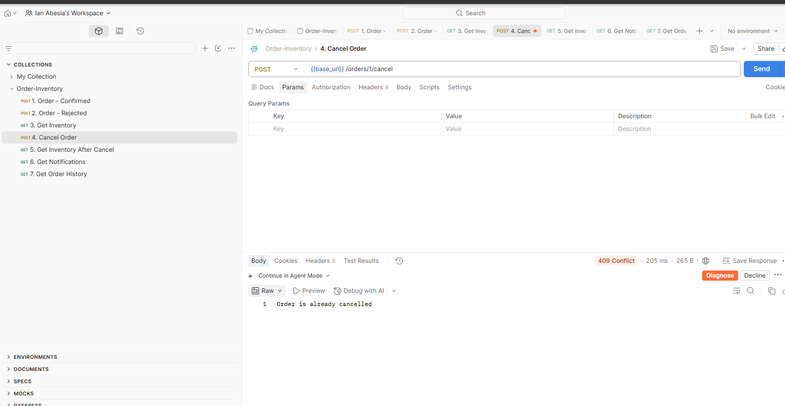
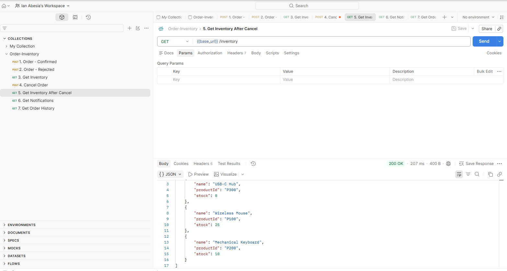
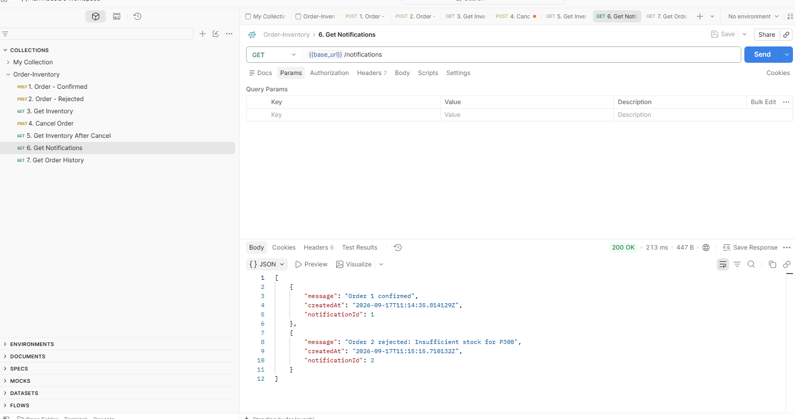

# Order-Inventory App

A single Spring Boot application with three in-process modules — **Order**, **Inventory**, and **Notification** — backed by a shared Supabase (Postgres) database, connected to a React (Vite) frontend over REST. Order and Inventory communicate via direct method calls; Order and Notification communicate via Spring's in-process event publisher (no direct dependency between them).

## Stack

- Backend: Java, Spring Boot, Spring Data JPA
- Frontend: React (Vite)
- Database: Supabase (Postgres)

## Project Structure

```
edu.cit.Abesia               <- @SpringBootApplication root (scans all modules)
edu.cit.Abesia.shop          <- Order module
edu.cit.Abesia.inventory     <- Inventory module
edu.cit.Abesia.notification  <- Notification module (Lab 2)
edu.cit.Abesia.events        <- Domain event classes (OrderPlacedEvent, OrderRejectedEvent, LowStockEvent)
```

---

## Supabase Setup

1. Create a free project at [supabase.com](https://supabase.com).
2. Open the **SQL Editor** and run `schema.sql` (included in this repo) to create and seed the `inventory`, `orders`, `order_items`, and `notifications` tables. The script recreates the schema from scratch, so it's safe to re-run for a clean reset.
3. Grab your database connection string, username, and password from **Project Settings → Database**.
4. Set these as environment variables (do **not** commit them to Git):

   ```
   SPRING_DATASOURCE_URL=jdbc:postgresql://<your-supabase-host>:5432/postgres
   SPRING_DATASOURCE_USERNAME=<your-username>
   SPRING_DATASOURCE_PASSWORD=<your-password>
   ```

5. Reference these in `application.properties` via `${DB_URL}`, `${DB_USERNAME}`, `${DB_PASSWORD}`, and confirm `.gitignore` excludes any local `.env` file or hardcoded credentials.

## Running the Backend

```bash
cd backend/order-inventory
./mvnw spring-boot:run
```

Backend runs on `http://localhost:8080`.

## Running the Frontend

```bash
cd frontend
npm install
npm run dev
```

Frontend runs on `http://localhost:5173`. CORS is enabled for this origin.

---

## API

### POST `/api/orders`

Now accepts multiple line items. Every item is validated against current stock **before** anything is reserved — if any single item doesn't have enough stock, the whole order is rejected and nothing is reserved (no partial fulfillment).

Request:
```json
{ "items": [{ "productId": "P100", "quantity": 3 }, { "productId": "P200", "quantity": 2 }] }
```

Response (confirmed):
```json
{
  "orderId": 1,
  "status": "CONFIRMED",
  "reason": null,
  "items": [
    { "productId": "P100", "outcome": "RESERVED" },
    { "productId": "P200", "outcome": "RESERVED" }
  ],
  "inventory": [ ... ]
}
```

Response (rejected — note `items` is empty, proving nothing was reserved):
```json
{
  "orderId": 2,
  "status": "REJECTED",
  "reason": "Insufficient stock for P300",
  "items": [],
  "inventory": [ ... ]
}
```

### POST `/api/orders/{orderId}/cancel`

Sets the order to `CANCELLED` and restocks every line item back to inventory via `InventoryService.restock()`. Returns `404` if the order doesn't exist, `409` if it's already cancelled.

### GET `/api/inventory`

Returns all products with current stock.

### GET `/api/orders`

Returns order history with status and line items.

### GET `/api/notifications`

Returns the notification log (order confirmations, rejections, and low-stock alerts) as an activity feed.

---

## In-Monolith Domain Events

`OrderService` never calls the Notification module directly. Instead, it publishes `OrderPlacedEvent` / `OrderRejectedEvent` via Spring's `ApplicationEventPublisher`. The Notification module listens with `@EventListener` and writes a message to the `notifications` table. Neither module imports the other — Notification depends only on the event classes in `edu.cit.Abesia.events`, and Order/Inventory have no import of anything in `edu.cit.Abesia.notification`.

After any successful `reserve()`, if a product's remaining stock drops below the configured threshold (5), a separate `LowStockEvent` is published and logged as a distinct "reorder needed" entry.

Event listeners in this project run **synchronously** (not `@Async`). [Note whether you kept it this way or changed it, and why — see reflection question 2 below for the reasoning to draw from.]

---

## Database Changes (Lab 2)

- `orders` table: `status` column now supports `CANCELLED` in addition to `CONFIRMED`/`REJECTED`.
- New `order_items` table: `order_id`, `product_id`, `quantity` — supports multi-item orders.
- New `notifications` table: `notification_id`, `message`, `created_at`.

`schema.sql` recreates the full schema (Lab 1 + Lab 2) from scratch, including seed data — safe to re-run anytime to reset.

---

## Testing Evidence

### 1. Multi-item order — all items succeed (CONFIRMED)



### 2. Multi-item order — one item fails, whole order REJECTED (all-or-nothing)



### 3. Cancel with restock reflected in GET /api/inventory




### 4. Notification feed — confirmed, rejected, and low-stock entries


---

## Reflection

**1. Multi-item orders now touch InventoryService several times within one request. What ensures this stays atomic in-process, and what would you need to add (sagas, compensating transactions) if Order and Inventory were split across a network?**

I check the stock for every item first, and only start reserving once I know all of them will succeed — that's what makes it all-or-nothing without needing rollback logic. Since it's all one method call in one app, I can also wrap it in a single @Transactional so if anything unexpected fails, everything rolls back together automatically. If Order and Inventory were split over a network, I'd lose that shared transaction completely. Each reserve() call would be its own network request, so if one item succeeds and a later one fails, I'd have to manually call restock() on the ones that already went through to undo them — basically building my own saga with compensating actions instead of getting it for free.
-
**2. How does publishing an event instead of calling Notification directly change the coupling between OrderService and Notification? What would you need if Notification became a separate microservice?**
-
Publishing an event means OrderService doesn't need to know Notification exists at all — it just announces "an order happened" and moves on, with zero reference to Notification's classes. That's way looser than a direct method call, since I could remove or change Notification entirely and OrderService wouldn't need to change. If Notification became its own microservice, a plain in-process event wouldn't work anymore since that only works inside one JVM. I'd need a real message broker like RabbitMQ or Kafka so the event goes into a queue, and I'd need to think about delivery guarantees — like making sure the message waits in the queue and doesn't just get lost if Notification's service happens to be down.

**3. You now have three modules and two distinct event types. If forced to extract exactly one module into its own microservice first, which would you pick and why — and what changes in your code to do it?**
-
I'd extract Notification first, not Inventory. Notification only listens and logs — nothing depends on it to keep working, so if it goes down, orders can still go through fine. Inventory is way riskier to split first since every single order depends on it directly. To actually extract Notification, I'd swap the in-process event publisher for a message broker, and give Notification its own database instead of sharing tables with the monolith. Order and Inventory's logic barely changes since they were already just "publish and move on" — only where the event goes would be different.