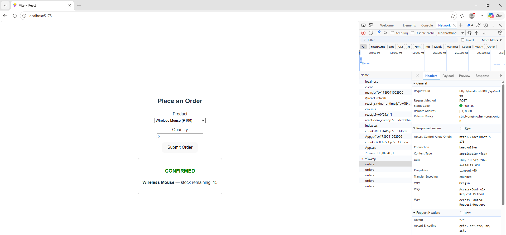
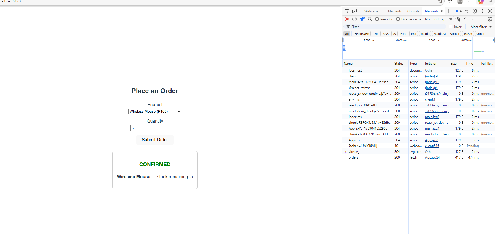
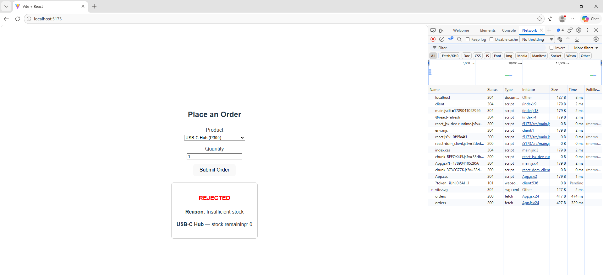

# Order-Inventory App

A single Spring Boot application with two in-process modules — **Order** and **Inventory** — backed by a shared Supabase (Postgres) database, connected to a React (Vite) frontend over REST.

## Stack

- Backend: Java, Spring Boot, Spring Data JPA
- Frontend: React (Vite)
- Database: Supabase (Postgres)

## Project Structure

```
edu.cit.abesia            <- @SpringBootApplication root (scans both modules)
edu.cit.abesia.shop       <- Order module
edu.cit.abesia.inventory  <- Inventory module
```

---

## Supabase Setup

1. Create a free project at [supabase.com](https://supabase.com).
2. Open the **SQL Editor** and run `schema.sql` (included in this repo) to create and seed the `inventory` and `orders` tables.
3. Grab your database connection string, username, and password from **Project Settings → Database**.
4. Set these as environment variables (do **not** commit them to Git):

   ```
   SPRING_DATASOURCE_URL=jdbc:postgresql://<your-supabase-host>:5432/postgres
   SPRING_DATASOURCE_USERNAME=<your-username>
   SPRING_DATASOURCE_PASSWORD=<your-password>
   ```

5. Reference these in `application.properties` via `${SPRING_DATASOURCE_URL}` etc., and confirm `.gitignore` excludes any local `.env` file or hardcoded credentials.

## Running the Backend

```bash
cd backend/order-inventory
./mvnw spring-boot:run
```

Backend runs on `http://localhost:8080`.

## Running the Frontend

```bash
cd frontend
npm install
npm run dev
```

Frontend runs on `http://localhost:5173`.

## API

**POST** `/api/orders`

Request:
```json
{ "productId": "P100", "quantity": 5 }
```

Response:
```json
{
  "status": "CONFIRMED",
  "reason": null,
  "inventory": { "productId": "P100", "name": "Wireless Mouse", "stock": 20 }
}
```

---

## Testing Evidence

### Confirmed order (P100, quantity 5)

__

### Rejected order (P300, quantity 1)

__

---

## Reflection

**1. In-process vs. microservice integration — what do you get for free, and what would you need to add back if split?**


Calling `InventoryService` in-process from `OrderService` means the call is just a Java method invocation: no network round trip, no serialization/deserialization, no separate deployment, and no partial-failure handling to think about. If `reserve()` throws, it throws synchronously in the same thread, and both the inventory update and the order write can even share the same database transaction, giving you atomicity for free — either both succeed or both roll back.

If Order and Inventory were split into separate microservices communicating over HTTP or messaging, all of that goes away and has to be rebuilt deliberately: network calls introduce latency and can fail independently of application logic (timeouts, dropped connections), so you'd need retries, circuit breakers, and timeouts. You'd lose the shared transaction, so you'd need a way to keep the two services consistent when one succeeds and the other doesn't — an outbox pattern, sagas, or eventual consistency with compensating actions. You'd also need service discovery, versioned API contracts between the two services, and separate monitoring/logging per service instead of one unified stack trace.

**2. Why does package-private visibility on `InventoryServiceImpl` matter — what breaks if it's public?**


Making `InventoryServiceImpl` package-private forces every consumer, including the Order module, to depend only on the `InventoryService` interface. This is what actually enforces the module boundary at compile time rather than just by convention: the Order module physically cannot import or new-up the concrete implementation, so it can't accidentally reach into Inventory's internals, call an implementation-specific method that isn't on the interface, or become coupled to how Inventory stores or manages state internally.

If `InventoryServiceImpl` were public, nothing would stop another module from injecting or instantiating it directly, bypassing the interface entirely. That quietly turns your "modular monolith" into a tightly coupled ball of mud — the moment Order depends on concrete Inventory internals, you can no longer change Inventory's implementation without also checking Order, and you'd lose the exact seam you'd need later to extract Inventory into its own service.

**3. When would you extract Inventory into its own microservice, and what would need to change?**


You'd consider extracting Inventory once it has meaningfully different scaling, deployment, or ownership needs than Order — for example, if Inventory needs to scale independently under much higher read traffic, if a separate team owns it and wants to deploy on its own schedule, or if other services besides Order also need to read/update stock and a shared in-process call no longer makes sense.

To actually split it, the `InventoryService` interface becomes the contract for a REST (or messaging) API instead of a Java interface — `OrderService` would call it over HTTP through a client/adapter that implements the same interface, so the rest of the Order module's code wouldn't need to change. You'd need to give Inventory its own database (or at least its own schema/tables) rather than sharing tables directly, since two services should not both write straight to the same table without a service boundary in front of it. You'd also need to add resilience (timeouts, retries, fallback behavior for when Inventory is unreachable), and decide how to keep the order and inventory states consistent without a shared transaction — likely via an event-driven approach (e.g., Inventory publishes a "stock reserved" event, Order reacts to it) rather than the direct synchronous call you have today.
